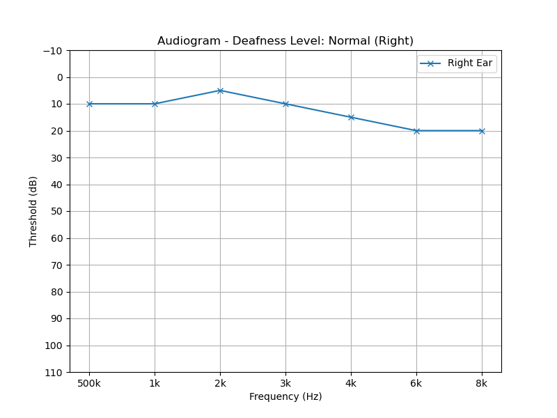

### **README.md**

# Tinnitus Detection in Audiograms using Deep Learning


A Convolutional Neural Network (CNN) developed with PyTorch to classify audiogram images and identify patients at risk of tinnitus. After expanding the dataset, the model achieves a **validation accuracy of 93.25%**.

---

## Motivation & Problem Statement

This project holds a special, personal significance for me. After recently being diagnosed with tinnitus myself, I was motivated to apply my data science skills to better understand the condition and contribute something positive to the space.

Tinnitus is a widespread auditory condition that affects the quality of life for millions of people. Early and accurate diagnosis is crucial but can be challenging. Audiograms, which are visual representations of a person's hearing ability, often contain subtle patterns that can indicate a risk of tinnitus.

My goal was to explore whether a deep learning model could be trained to automatically recognize these patterns. In doing so, I aimed not only to deepen my own knowledge but also to create a tool that could potentially assist medical professionals in diagnosis and help raise awareness of this condition.

## Dataset

The initial dataset for this project was sourced from the "Tinnitus Detection" notebook on Kaggle. To improve model performance and robustness, this was later supplemented with a second, more varied dataset containing different levels of hearing loss.

*   **Data Source 1:** [Kaggle - Tinnitus Detection](https://www.kaggle.com/code/ashikshahriar/tinnitus-detection/notebook)
*   **Data Source 2:** [Kaggle - Audiogram Hearing-Loss Classification](https://www.kaggle.com/datasets/khalidkamal/audiogram-hearingloss-classification)

The `prepare_data.py` and `prepare_new_dataset.py` scripts process this raw data, map varied hearing loss levels (e.g., 'Mild', 'Severe') to the 'tinnitus' class, split the combined data into training (80%) and validation (20%) sets, and organize it for PyTorch.

### What is an Audiogram?

An audiogram is a graphical representation of the results of a hearing test, showing a person's hearing thresholds across various frequencies. It helps in diagnosing and monitoring hearing loss by charting the softest sound levels (in decibels, dB) that a person can hear at different frequencies (in Hertz, Hz).

*   **What does an audiogram show?**
    *   It displays a person's hearing thresholds—the quietest sound level they can perceive at different frequencies.
    *   The horizontal axis (X-axis) represents sound frequency (Hz), while the vertical axis (Y-axis) represents sound intensity (dB).
    *   Results are plotted as symbols (e.g., "O" for the right ear, "X" for the left ear).

*   **What can be interpreted from an audiogram?**
    *   **Degree and Type of Hearing Loss:** It quantifies severity (mild, moderate, severe) and can indicate the type (e.g., sensorineural).
    *   **Affected Frequencies:** It reveals which ranges (low, mid, high tones) are affected.

## Methodology

This project follows a classic workflow for image classification using transfer learning.

#### 1. Model Architecture (`train.py`)
*   **Transfer Learning:** A **ResNet18** model, pre-trained on the ImageNet dataset, was used to leverage its existing knowledge of patterns and shapes.
*   **Customization:** The final layer of the ResNet18 model was replaced with a new classifier optimized for our two classes (`normal` vs. `tinnitus`), including a **Dropout layer (p=0.5)** for regularization.

#### 2. Training (`train.py`)
*   **Framework:** PyTorch
*   **Optimizer:** Adam (`lr=1e-4`)
*   **Data Augmentation:** To make the model more robust, random transformations like horizontal flips, rotations, and color jitter were applied to the training data.

## Results & Key Insights

After training on the combined dataset, the model's performance significantly improved, demonstrating excellent generalization.

| Metric         | Training Set | Validation Set   |
| -------------- | ------------ | ---------------- |
| **Accuracy**   | 93.53%       | **93.25%**       |
| **Loss**       | 0.1698       | 0.1634           |

### A Key Insight: Understanding Model Uncertainty

During my journey with this project, one of the most profound learning moments came not from a high-confidence success, but from a low-confidence prediction. The model analyzed the following audiogram:



It returned a prediction of **"Normal"** but with a very low confidence of **58.49%**. This initially seemed like a weakness, but it led me to a key insight into how the model "thinks":

*   **The "Normal" Signal (58.49%):** The model correctly recognized that all data points fall within the 0-25 dB range, which is clinically defined as normal hearing.
*   **The "Tinnitus" Signal (41.51%):** However, the model also detected a conflicting pattern: a **distinct downward slope in the high frequencies** (from 2kHz to 8kHz). Through its training, the model learned that this shape is a common feature in audiograms of patients with tinnitus.

**The Learning Journey Insight:**
The model's low confidence was not a failure; it was **successfully communicating its own uncertainty**. It correctly identified the ambiguity of a borderline case. This taught me that the goal of a robust AI model isn't always to be 100% certain, but to accurately reflect the complexity of the data. For a real-world application, this is invaluable, as it allows for a **"human-in-the-loop"** system where ambiguous cases are flagged for expert review.

## How to Use

### Method 1: Local Environment
1.  **Clone the repository:**
    ```bash
    git clone https://github.com/YourUsername/your-repo-name.git
    cd your-repo-name
    ```
2.  **Set up the Conda environment:**
    The `environment.yml` file is provided for easy setup.
    ```bash
    conda env create -f environment.yml
    conda activate tinnitus-projekt
    ```
3.  **Place the data:**
    Download the raw data from the sources linked above and place them in `audiogram_dataset/` and `new_dataset/` folders respectively.
4.  **Prepare the data:**
    Run the scripts sequentially to process both datasets.
    ```bash
    python prepare_data.py
    python prepare_new_dataset.py
    ```
5.  **Train the model:**
    ```bash
    python train.py
    ```
6.  **Make a prediction on a new image:**
    ```bash
    python predict.py --image "path/to/your/image.jpg"
    ```

### Method 2: Using Docker (Recommended for Reproducibility)
This method handles all software dependencies automatically.

1.  Follow steps 1 and 3 from Method 1 to clone the repo and place the data.
2.  Prepare the data by running `python prepare_data.py` and `python prepare_new_dataset.py`.
3.  **Build the Docker image:**
    ```bash
    docker build -t tinnitus-trainer .
    ```
4.  **Run the training:**
    This command saves the final model to a `models/` folder on your computer.
    ```bash
    # For PowerShell/Linux/macOS
    docker run --rm -v ${PWD}/models:/app/models tinnitus-trainer
    # For Windows CMD
    docker run --rm -v "%cd%/models":/app/models tinnitus-trainer
    ```

## Future Work
*   **Inference Script:** Develop a script to load a single audiogram image and make a live prediction. *(Done with `predict.py`)*
*   **Model Tuning:** Experiment with larger architectures (e.g., ResNet34/50) and hyperparameter optimization.
*   **Web App:** Create a simple web interface (e.g., using Streamlit or Flask) where a user can upload an audiogram and see the model's prediction and confidence score.

---
*This project was developed as part of my personal learning journey in data science and is motivated by my own experiences with the subject.*