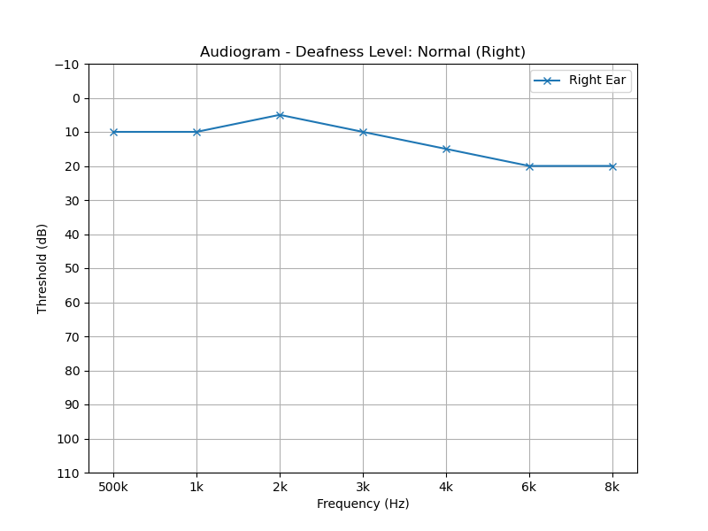
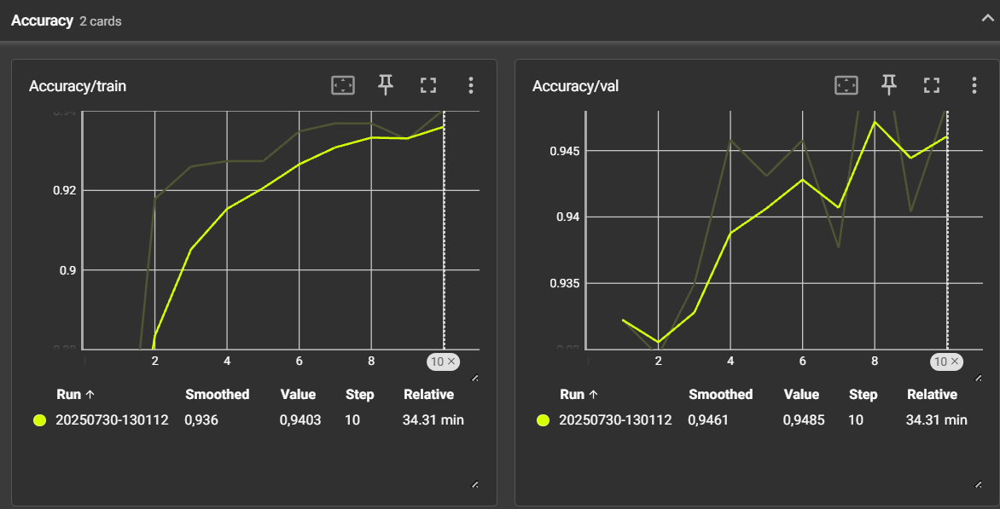
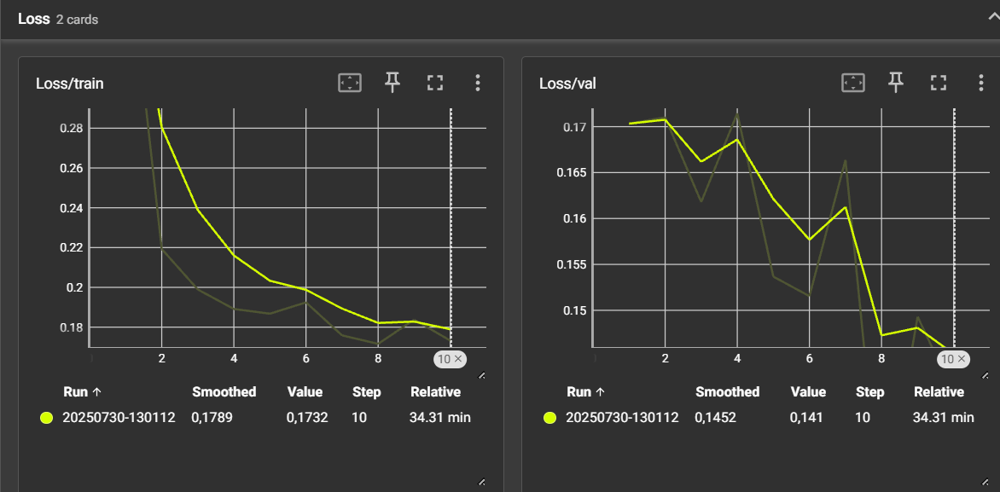

# Tinnitus Detection in Audiograms using Deep Learning


A Convolutional Neural Network (CNN) developed with PyTorch to classify audiogram images as either showing normal hearing or indicating a risk of tinnitus. The model is containerized with Docker and achieves a validation accuracy of **94.58%**.

---

## Motivation & Problem Statement

This project holds a special, personal significance for me. After recently being diagnosed with tinnitus myself, I was motivated to apply my data science skills to better understand the condition and contribute something positive to the space. 

Tinnitus is a widespread auditory condition that affects the quality of life for millions of people. Early and accurate diagnosis is crucial but can be challenging. Audiograms, which are visual representations of a person's hearing ability, often contain subtle patterns that can indicate a risk of tinnitus.

My goal was to explore whether a deep learning model could be trained to automatically recognize these patterns. In doing so, I aimed not only to deepen my own knowledge but also to create a tool that could potentially assist medical professionals in diagnosis and help raise awareness of this condition.

## Understanding the Data: What is an Audiogram?

Before diving into the model, it's helpful to understand what an audiogram represents. In simple terms, an audiogram is a chart that shows the results of a hearing test. It reveals the softest sounds a person can hear at different pitches or frequencies.

*   **Horizontal Axis (X-axis):** Represents frequency (pitch), from low pitches (like a bass drum) on the left to high pitches (like a whistle) on the right.
*   **Vertical Axis (Y-axis):** Represents hearing level in decibels (dB), from very soft sounds at the top to very loud sounds at the bottom.

A line near the top of the chart indicates normal hearing. When the line dips downwards, it signifies hearing loss at those specific frequencies. For tinnitus-related hearing loss, it's common to see a sharp drop in the high-frequency range.

**Normal Hearing vs. Tinnitus-Related Hearing Loss**

| Normal Hearing Example | Tinnitus-Related Hearing Loss Example |
| :--------------------: | :-----------------------------------: |
|  |  |

## Dataset

The dataset for this project was sourced from the "Tinnitus Detection" notebook on Kaggle. Thank you to Ashik Shahriar for making this data available.

- [Kaggle - Tinnitus Detection Notebook](https://www.kaggle.com/code/ashikshahriar/tinnitus-detection/notebook)
- [Kaggle - Audiological Data](https://www.kaggle.com/datasets/danielasgo/audiogramm-data-for-hearing-loss-classification/data)

The dataset consists of **1018 audiogram images**. The raw data is organized into `Right Ear Charts` and `Left Ear Charts` folders. Each image is labeled by a prefix in its filename:
*   `N... .jpg`: Normal hearing
*   `T... .jpg`: Tinnitus diagnosed

**Important Note:** The raw data is **not** included in this GitHub repository to keep its size small. You must download the data manually from the sources linked above to run the project.

## Core Methodology
- **Architecture:** ResNet18 with transfer learning
- **Classes:** `normal` and `tinnitus` (binary classification)
- **Regularization:** Dropout (p=0.5)
- **Environment:** Reproducible via Conda and Docker
- **Logging:** TensorBoard used to monitor training metrics

## How to Run This Project

### Local Training with Conda (Recommended Start)
This method creates an exact replica of the development environment on your local machine.

1.  **Clone the repository:**
    ```bash
    git clone https://github.com/danielBasgo/tinnitus-trainer.git
    cd tinnitus-trainer
    ```

2.  **Create and activate the Conda environment:**
    The `environment.yml` file contains all necessary dependencies. This command creates and activates an environment named `tinnitus-trainer`.
    ```bash
    conda env create -f environment.yml
    conda activate tinnitus-trainer
    ```

3.  **Download and place the data:**
    *   Download the data from **Data Source 1**. Create a folder named `audiogram_dataset` in the project root and place the `Left Ear Charts` and `Right Ear Charts` folders inside it.
    *   Download and unzip the data from **Data Source 2**. Create a folder named `new_dataset` in the project root and place the `Mild` and `Moderate` etc. folders from the unzipped data inside it.

    Your final folder structure should look like this:
    ```
    tinnitus-trainer/
    ├── audiogram_dataset/
    │   ├── Left Ear Charts/
    │   └── Right Ear Charts/  (from Data Source 1)
    ├── new_dataset/
    │   ├──new (from Data Source 2)
    │   ├──Mild 
    │   ├──Moderate 
    └── ... (other files and folders)
    ```

4.  **Prepare the data:**
    Run the script 'prepare_all_data.py' to process both datasets and create the final `processed_data` folder. The `prepare_data.py` script processes this raw data, splits it into a training set (80%) and a validation set (20%), and organizes it into a directory structure suitable for PyTorch's `ImageFolder`.
    ```bash
    python prepare_all_data.py
    ```

5.  **Train the model:**
    ```bash
    python train.py
    ```

6.  **Make a prediction on a new audiogram:**

After training, you can classify new images:
    ```bash
    python predict.py --image "path/to/your/image.jpg"
    ```

#### Example Output:
```
--- Prediction for: audiogram1.jpg ---
  -> Predicted Class: tinnitus
  -> Confidence:      58.49%
```

## Results & Key Insights
After training on the combined dataset, the model achieved an outstanding performance with a **validation accuracy of 94.58%**.

A key insight came from a low-confidence prediction (58.49%) for a borderline audiogram. The model correctly identified conflicting features (normal dB levels vs. a high-frequency slope associated with tinnitus). This taught me that a robust AI model's ability to communicate its own uncertainty is a crucial feature, enabling a "human-in-the-loop" system where ambiguous cases are flagged for expert review.



## Visualizing Training with TensorBoard

```bash
tensorboard --logdir=runs
```
Open [http://localhost:6006](http://localhost:6006) in your browser.

---

📉 Training Metrics (via TensorBoard)

The training process was tracked using [TensorBoard](https://www.tensorflow.org/tensorboard), which provides visual insights into the model's learning behavior. Below are the smoothed training and validation metrics over 10 epochs.

| Accuracy | Loss |
|----------|------|
|  |  |

The model shows a steady improvement in both training and validation accuracy, reaching ~94.58% on the validation set. Loss curves demonstrate consistent convergence without overfitting, which indicates that the regularization (dropout) and data augmentation strategies were effective.

## Docker Containerization

This project includes a Dockerfile based on the continuumio/miniconda3:latest image to provide a consistent, scientifically optimized environment. First, build the Docker image:

```bash

$ docker build -t tinnitus-trainer:latest .
```
Next, run a container and mount your audiogram dataset and any output directories:

```bash
$ docker run --rm \
  -v $(pwd)/audiogram_dataset:/app/audiogram_dataset \
  -v $(pwd)/new_dataset:/app/new_dataset \
  tinnitus-trainer:latest \
  python train.py
```
For inference with the trained model:
```bash
$ docker run --rm \
  -v $(pwd)/path/to/your/image.jpg:/app/image.jpg \
  tinnitus-trainer:latest \
  python predict.py --image "/app/image.jpg"
```

All dependencies are encapsulated within the container, ensuring reproducibility on any system with Docker installed.

## Future Work
*   **ML Deployment:** Deploy the trained model as a live API endpoint.
*   ~~**Web App:** Create a simple web interface (e.g., using Streamlit or Flask) that allows users to upload an audiogram and receive a prediction from the model's API.~~ credit to Vivienne
*   ~~**mySQL Database concept:** Build a Database in mySQL~~ credit to Janik

---
*This project was developed as part of my personal learning journey in data science and is motivated by my own experiences with the subject. A special thanks to my Teammates Vivienne and Janik (DanJanViv) for adding essential Features to this Project. And of course the tutors at DSI for their invaluable feedback and support.*
